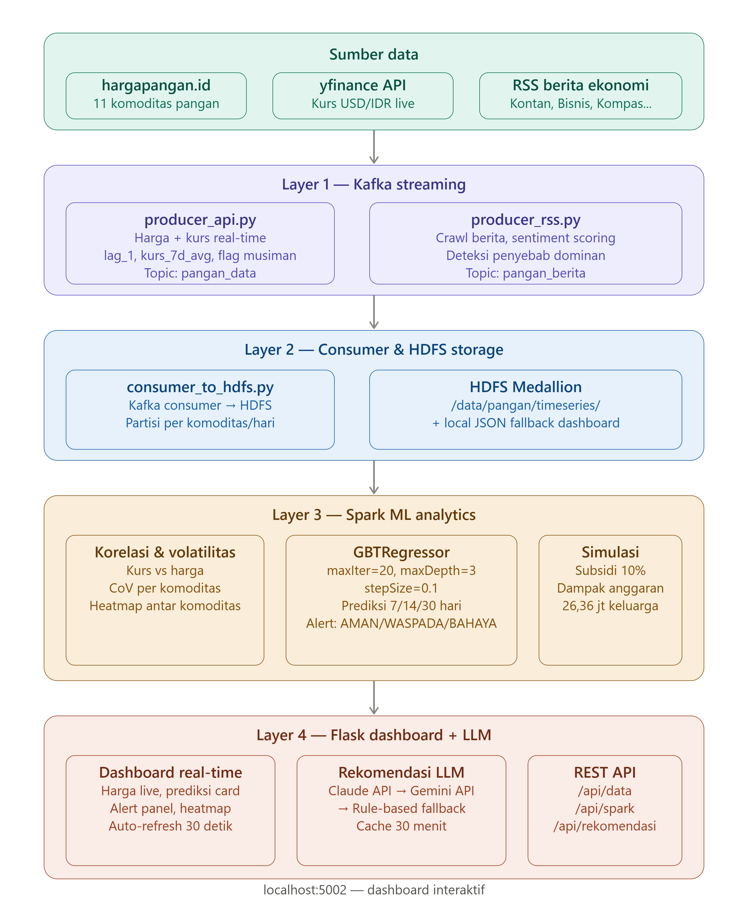

# Big Data Analytics: Prediksi & Stabilisasi Harga Pangan Indonesia

**Kelompok 8** · Semester 4 · Institut Teknologi Sepuluh Nopember (ITS)
Stack: Apache Kafka, Hadoop HDFS, Apache Spark GBT MLlib, Flask, LLM (Claude/Gemini)

---

Kurs dolar AS menembus Rp18.209 pada 9 Juni 2026, rekor tertinggi sepanjang sejarah. Indonesia masih mengimpor gandum 10,6 juta ton per tahun, kedelai 2,5 juta ton per tahun, dan gula 4,4 juta ton per tahun. Kami membangun sistem yang memprediksi harga 11 komoditas pangan strategis untuk 7, 14, dan 30 hari ke depan, lengkap dengan deteksi penyebab kenaikan harga, peringatan dini otomatis, dan rekomendasi intervensi berbasis LLM (Claude/Gemini).

## Daftar Anggota

| No | Nama | NRP |
|----|------|-----|
| 1  | Revalina Erica P. | 5027241007 |
| 2  | Syifa Nurul A. | 5027241019 |
| 3  | Azaria Raissa M. | 5027241043 |
| 4  | Nisrina Bilqis | 5027241054 |

---

## Latar Belakang Masalah

Kurs dolar AS menembus **Rp18.209 pada 9 Juni 2026**, rekor tertinggi sepanjang sejarah. Indonesia masih bergantung pada impor untuk beberapa komoditas strategis:

| Komoditas | Volume Impor/Tahun |
|-----------|-------------------|
| Gandum    | 10,6 juta ton |
| Kedelai   | 2,5 juta ton |
| Gula      | 4,4 juta ton |

Kenaikan kurs berdampak langsung ke harga pangan di tingkat konsumen. Sayangnya, sistem peringatan dini berbasis data yang bisa memprediksi lonjakan harga sebelum benar-benar terjadi masih belum banyak tersedia di Indonesia.

**Masalahnya:** pemerintah dan pelaku pasar belum punya sistem terukur yang bisa memprediksi harga 7 sampai 30 hari ke depan dengan mempertimbangkan kurs, sentimen berita, dan musiman secara bersamaan.

**Solusi yang kami buat:** platform big data dari hulu ke hilir yang memproses data streaming secara real-time, melatih model prediktif GBT untuk tiap komoditas, dan otomatis menghasilkan rekomendasi intervensi kebijakan berbasis LLM.

---

## Deskripsi Masalah

Ketidakstabilan harga pangan adalah ancaman nyata bagi 270 juta penduduk Indonesia, terutama 26,36 juta keluarga miskin yang mengalokasikan lebih dari 60% pengeluaran mereka untuk pangan (BPS, 2024). Lonjakan kurs USD/IDR ke **Rp18.209 pada 9 Juni 2026**, yang tertinggi sepanjang sejarah, langsung menaikkan biaya impor gandum, kedelai, dan gula yang jadi tulang punggung rantai pangan nasional.

Inti masalahnya: **belum ada sistem peringatan dini berbasis data yang bisa memprediksi kenaikan harga 7 sampai 30 hari ke depan** sebelum dampaknya dirasakan konsumen. Sistem yang sudah ada cuma memantau harga historis, bukan memproyeksikan ke depan. Akibatnya, intervensi kebijakan seperti operasi pasar atau impor darurat selalu terlambat dan sifatnya reaktif.

## Tujuan Proyek

- Membangun pipeline data streaming real-time menggunakan Apache Kafka untuk mengalirkan data harga pangan, kurs USD/IDR, dan sentimen berita ekonomi secara bersamaan
- Menyimpan dan mengelola data time series tiap komoditas di Hadoop HDFS dengan partisi berdasarkan tanggal, supaya analisis historis lebih mudah
- Melatih model Gradient Boosted Trees (GBTRegressor) lewat Apache Spark MLlib untuk memprediksi harga 7, 14, dan 30 hari ke depan dengan 8 fitur multi-dimensi
- Membangun sistem peringatan dini otomatis berbasis threshold statistik (mean plus 1,5 sigma atau 2,0 sigma) per komoditas
- Mengintegrasikan LLM (Claude/Gemini) untuk menghasilkan rekomendasi intervensi kebijakan yang langsung bisa ditindaklanjuti, berdasarkan alert aktif dan berita relevan
- Menyajikan semua analisis dalam dashboard real-time yang bisa langsung diakses pengambil keputusan

---

## Diagram Alur Sistem

```
┌─────────────────────────────────────────────────────────────────────────┐
│                          SUMBER DATA (Real-Time)                        │
│                                                                         │
│  ┌─────────────────┐  ┌──────────────────┐  ┌──────────────────────┐   │
│  │  hargapangan.id │  │  yfinance API    │  │  RSS Berita Ekonomi  │   │
│  │  (7 komoditas)  │  │  (Kurs USD/IDR)  │  │  (Kontan, Kompas...) │   │
│  └────────┬────────┘  └────────┬─────────┘  └──────────┬───────────┘   │
└───────────┼────────────────────┼───────────────────────┼───────────────┘
            │                    │                        │
            ▼                    ▼                        ▼
┌─────────────────────────────────────────────────────────────────────────┐
│                     LAYER 1 : KAFKA STREAMING                           │
│                                                                         │
│  ┌───────────────────────┐        ┌──────────────────────────────────┐  │
│  │  producer_api.py      │        │  producer_rss.py                 │  │
│  │  • Harga + kurs live  │        │  • Crawl berita 5 sumber         │  │
│  │  • Fitur turunan:     │        │  • Sentiment scoring (+1/0/-1)   │  │
│  │    - lag_1 (harga-1)  │        │  • Ekstrak penyebab_dominan:     │  │
│  │    - kurs_7d_avg      │        │    kurs/cuaca/kebijakan/pasokan  │  │
│  │    - flag_lebaran      │        │  • Tag komoditas per artikel     │  │
│  │    - flag_panen        │        │                                  │  │
│  │    - flag_impor_ekspor │        │  Topic: pangan_berita            │  │
│  │  Topic: pangan_data    │        └──────────────────────────────────┘  │
│  └───────────────────────┘                                               │
└─────────────────────────────────────────────────────────────────────────┘
                                    │
                                    ▼
┌─────────────────────────────────────────────────────────────────────────┐
│                     LAYER 2 : CONSUMER & HDFS STORAGE                  │
│                                                                         │
│  consumer_to_hdfs.py                                                    │
│  ┌──────────────────────────────────────────────────────────────────┐   │
│  │  Kafka Consumer (auto-reconnect, earliest offset)                │   │
│  │         │                                                        │   │
│  │         ├──► HDFS: /data/pangan/timeseries/{komoditas}/{tanggal} │   │
│  │         │           (partisi per komoditas per hari)              │   │
│  │         │                                                        │   │
│  │         └──► Local: dashboard/data/                              │   │
│  │                  ├── live_summary.json   (harga live)             │   │
│  │                  ├── live_api.json       (raw harga+fitur)        │   │
│  │                  ├── live_rss.json       (berita+sentimen)        │   │
│  │                  └── timeseries_{slug}.json  (array 30 hari)     │   │
│  └──────────────────────────────────────────────────────────────────┘   │
└─────────────────────────────────────────────────────────────────────────┘
                                    │
                                    ▼
┌─────────────────────────────────────────────────────────────────────────┐
│                     LAYER 3 : SPARK ML ANALYTICS                        │
│                                                                         │
│  spark/analysis.py  (dijalankan tiap 2 menit via scheduler)            │
│                                                                         │
│  ┌──────────────┐  ┌──────────────────┐  ┌──────────────────────────┐  │
│  │  Analisis 1  │  │  Analisis 2      │  │  Analisis 3              │  │
│  │  Korelasi    │  │  Volatilitas     │  │  Heatmap Korelasi        │  │
│  │  Kurs vs     │  │  Harga (CoV)     │  │  Antar Komoditas         │  │
│  │  Harga       │  │                  │  │  (Spark stat.corr pivot) │  │
│  └──────────────┘  └──────────────────┘  └──────────────────────────┘  │
│                                                                         │
│  ┌──────────────────────────────────────────────────────────────────┐   │
│  │  Analisis 5 : MODEL PREDIKSI UTAMA (GBTRegressor)               │   │
│  │                                                                  │   │
│  │  Input Fitur (VectorAssembler):                                  │   │
│  │  [kurs_avg, kurs_7d_avg, flag_lebaran, flag_panen,              │   │
│  │   flag_impor_ekspor, lag_1, sentiment_score, lag_7*]            │   │
│  │                                                                  │   │
│  │  Model: GBTRegressor (maxIter=20, maxDepth=3, stepSize=0.1)     │   │
│  │  Fallback: LinearRegression (maxIter=100, regParam=0.01)         │   │
│  │                                                                  │   │
│  │  Output per komoditas:                                           │   │
│  │  ├── prediksi_7h, prediksi_14h, prediksi_30h                   │   │
│  │  ├── MAE + MAPE (evaluasi akurasi)                              │   │
│  │  └── alerts: AMAN / WASPADA / BAHAYA                            │   │
│  │      Threshold: WASPADA = mean + 1.5σ, BAHAYA = mean + 2.0σ    │   │
│  └──────────────────────────────────────────────────────────────────┘   │
│                                                                         │
│  ┌──────────────────────────────────────────────────────────────────┐   │
│  │  Analisis 6 : Simulasi Kebijakan Subsidi 10%                    │   │
│  │  Estimasi dampak finansial terhadap 26,36 jt keluarga miskin    │   │
│  └──────────────────────────────────────────────────────────────────┘   │
│                                                                         │
│  Output: dashboard/data/spark_results.json                              │
└─────────────────────────────────────────────────────────────────────────┘
                                    │
                                    ▼
┌─────────────────────────────────────────────────────────────────────────┐
│                     LAYER 4 : FLASK DASHBOARD + LLM                    │
│                                                                         │
│  dashboard/app.py                                                       │
│                                                                         │
│  Endpoint:                                                              │
│  ├── GET /            : Halaman dashboard utama                         │
│  ├── GET /api/data    : Semua data gabungan (kurs+harga+berita+spark)  │
│  ├── GET /api/spark   : Hasil prediksi + alert Spark                   │
│  ├── GET /api/timeseries/<slug> : Data historis 30 hari per komoditas  │
│  └── GET /api/rekomendasi : [FITUR UNGGULAN] Rekomendasi LLM           │
│           Chain: Claude API -> Gemini API -> Rule-Based Fallback         │
│           Cache: 30 menit (tidak spam API)                              │
│                                                                         │
│  dashboard/templates/index.html                                         │
│  ├── Harga pangan live (real-time)                                     │
│  ├── Prediksi card per komoditas (7h/14h/30h + badge status)           │
│  ├── Alert panel AMAN/WASPADA/BAHAYA                                    │
│  ├── Line chart historis 30 hari + garis prediksi ke depan             │
│  ├── Panel rekomendasi LLM + tombol refresh                            │
│  ├── Chart korelasi kurs & volatilitas                                  │
│  ├── Heatmap korelasi antar komoditas                                  │
│  └── Simulasi dampak subsidi kebijakan                                 │
└─────────────────────────────────────────────────────────────────────────┘

Akses: http://localhost:5002
```



---

## Tech Stack

| Layer | Teknologi | Fungsi |
|-------|-----------|--------|
| Containerization | Docker, Docker Compose | Orchestrasi semua service |
| Data Streaming | Apache Kafka (KRaft) | Message broker real-time |
| Storage | Hadoop HDFS | Distributed storage time series |
| ML Engine | Apache Spark 3.5 + MLlib | Training & inference model GBT |
| Feature Store | HDFS + local JSON | Fitur historis, musiman, sentimen |
| Backend API | Flask + Flask-CORS | REST API dashboard |
| LLM Integration | Claude API + Gemini API | Rekomendasi kebijakan otomatis |
| Frontend | HTML/CSS/JS + Chart.js | Dashboard interaktif real-time |
| Kurs Data | yfinance (USDIDR=X) | Kurs USD/IDR live |
| Berita | RSS Parsing | Sentimen & penyebab dominan |

---

## Struktur Direktori

```
fp-bigdata-kelompok8/
├── docker-compose.yml          : Semua services (Kafka, HDFS, Spark, Flask)
├── hadoop.env                  : Konfigurasi Hadoop
├── requirements.txt            : Python dependencies
├── run.sh                      : Script otomatis Linux/Mac
├── scripts/
│   └── init_infrastructure.py : Init Kafka topics + HDFS dirs
├── kafka/
│   ├── producer_api.py         : Producer harga pangan + kurs + fitur musiman
│   ├── producer_rss.py         : Producer berita + sentiment scoring
│   └── consumer_to_hdfs.py    : Consumer ke HDFS + local JSON timeseries
├── spark/
│   └── analysis.py             : 6 analisis Spark (korelasi, volatilitas,
│                                  heatmap, berita, GBT prediksi, subsidi)
└── dashboard/
    ├── app.py                  : Flask backend + endpoint /api/rekomendasi
    ├── Dockerfile
    ├── requirements-flask.txt
    ├── templates/
    │   └── index.html          : Dashboard real-time (prediksi + alert + LLM)
    └── data/                   : Auto-generated saat pipeline berjalan
        ├── live_summary.json
        ├── live_api.json
        ├── live_rss.json
        ├── spark_results.json
        └── timeseries_*.json   : Per komoditas (slug)
```

## Docker Services

| Komponen | Image / Source | Port | Fungsi |
| --- | --- | --- | --- |
| Kafka (KRaft) | confluentinc/cp-kafka:7.6.1 | 9092 | Message broker streaming |
| HDFS NameNode | bde2020/hadoop-namenode | 19870, 8020 | Storage HDFS utama (UI: http://localhost:19870) |
| HDFS DataNode | bde2020/hadoop-datanode | - | Node penyimpanan data |
| YARN | bde2020/hadoop-resourcemanager | 8088 | Resource manager cluster |
| Spark Master | apache/spark:3.5.0 | 8080, 7077 | Spark Master Node |
| Spark Worker | apache/spark:3.5.0 | - | Spark Worker Node |
| Flask Dashboard | fp-flask (Dockerfile) | 5002 (Host) | Dashboard UI utama (UI: http://localhost:5002) |
| Kafka Consumer | fp-consumer (Dockerfile.consumer) | - | Otomatis flush data ke HDFS & file lokal |

## Data Pipeline, Feature Engineering & ML Analytics

Pipeline data kami kembangkan supaya bisa menyediakan fitur historis, sinyal musiman, dan pemodelan prediktif yang lebih dalam, bukan cuma menampilkan harga apa adanya.

### 1. Ingesti Data & Fitur Musiman (`kafka/producer_api.py`)

* Kurs USD/IDR historis 35 hari diambil dari `yfinance` saat startup, dengan mekanisme simulasi cadangan kalau API sedang offline.
* Fitur turunan untuk model prediktif dibuat secara dinamis: `harga_kemarin` (lag_1), `kurs_7d_avg`, dan `kurs_30d_avg`.
* Ada penyuntikan flag musiman dari kalender Indonesia: `flag_lebaran`, `flag_panen`, dan `flag_impor_ekspor`.

### 2. Analisis Sentimen Berita Ekonomi (`kafka/producer_rss.py`)

* Scoring sentimen otomatis berbasis pencocokan kata kunci (+1 positif, 0 netral, -1 negatif) dari portal berita real-time.
* Ekstraksi `penyebab_dominan` ("kurs", "cuaca", "kebijakan", "pasokan", "umum") supaya grafik punya konteks yang jelas.

### 3. Pemodelan Prediktif & Evaluasi ML (`spark/analysis.py`)

* **Pipeline multi-fitur (Analisis 5):** memakai GBTRegressor (Gradient Boosted Trees) sebagai model utama untuk memproyeksikan harga komoditas pada horizon t+7, t+14, dan t+30 hari.
* **Fitur pemodelan:** memanfaatkan `kurs_avg`, `kurs_7d_avg`, `flag_lebaran`, `flag_panen`, `flag_impor_ekspor`, `lag_1`, `sentiment_score` (dari live RSS), dan `lag_7` (kalau data historisnya cukup).
* **Mekanisme fallback:** kalau data runtime suatu komoditas anomali atau gagal melatih pohon keputusan GBT, pipeline otomatis turun ke LinearRegression agar visualisasi dashboard tidak terputus.
* **Evaluasi performa:** tiap iterasi model menghitung metrik MAE (Mean Absolute Error) dan MAPE (Mean Absolute Percentage Error) secara real-time, supaya akurasi prediksi bisa dipantau langsung dari struktur data utama.

## Web UI Monitoring & Struktur Output JSON

| Service | URL |
| --- | --- |
| Dashboard Utama | http://localhost:5002 |
| HDFS NameNode | http://localhost:19870 |
| Spark Master | http://localhost:8080 |
| YARN | http://localhost:8088 |

### Tampilan Dashboard

**Harga pangan terkini dan prediksi multi-horizon (7/14/30 hari) per komoditas:**


**Status peringatan dini per komoditas, plus tren harga historis dan garis prediksi:**


**Rekomendasi intervensi kebijakan (LLM/rule-based) dan analisis korelasi-volatilitas kurs:**


**Berita ekonomi real-time dan heatmap korelasi antar komoditas:**


**Simulasi dampak kebijakan subsidi 10% terhadap anggaran dan inflasi:**


**Infrastruktur, Spark Master dengan job yang sudah tereksekusi dan HDFS dengan DataNode aktif serta NameNode overview:**


### Struktur Output JSON

File output utama `/dashboard/data/spark_results.json` distrukturkan dengan skema berikut untuk dikonsumsi frontend:

```json
{
  "generated_at": "ISO-Timestamp",
  "volatilitas": [...],
  "korelasi_kurs": [...],
  "heatmap": [...],
  "berita": [...],
  "prediksi": [
    {
      "komoditas": "Daging Sapi",
      "model": "GBT(fallback)",
      "prediksi_7h": 157062,
      "prediksi_14h": 157062,
      "prediksi_30h": 157062,
      "mae": 767.41,
      "mape_pct": 0.49,
      "alerts": { ... }
    }
  ],
  "alerts": [
    {
      "komoditas": "Cabai Rawit Merah",
      "horizon": "t7",
      "hari_ke": 7,
      "prediksi": 151793,
      "threshold_waspada": 120000,
      "threshold_bahaya": 140000,
      "status": "BAHAYA",
      "harga_saat_ini": 110000
    }
  ],
  "evaluasi_model": {
    "n_komoditas_diproses": 11,
    "rata_rata_mae": 7824.12,
    "rata_rata_mape_pct": 11.09,
    "detail_per_komoditas": [...]
  },
  "simulasi_subsidi": [...]
}
```

## Fitur Unggulan

### 1. Heatmap Korelasi Antar Komoditas

Matriks korelasi harga semua komoditas dihitung lewat Spark pivot dan `stat.corr`, supaya keterkaitan pergerakan antar komoditas pangan bisa terlihat secara makro.

### 2. Simulasi Dampak Kebijakan Subsidi

Menghitung dampak finansial dari intervensi subsidi 10% terhadap anggaran negara, jumlah keluarga miskin yang terbantu (26,36 juta jiwa berdasarkan data BPS 2024), dan estimasi penurunan angka inflasi pangan.

### 3. Early Warning System Berbasis Ambang Batas Statistik

Sistem ini tidak cuma memprediksi nominal harga ke depan, tapi juga menghitung ambang batas kerawanan secara dinamis untuk tiap komoditas, dengan rumus berikut:

* **Waspada:** mean + 1,5 kali standar deviasi
* **Bahaya:** mean + 2,0 kali standar deviasi

Kalau angka proyeksi menembus batas itu, sistem otomatis memberi label status `WASPADA` atau `BAHAYA` dan memasukkannya ke dalam daftar peringatan dini global.

### 4. Tracker Transparansi Akurasi Model

Menampilkan metrik performa MAE dan rata-rata MAPE secara transparan di dashboard (misalnya rata-rata MAPE saat ini ada di kisaran 11,09%), supaya keandalan prediksi bisa divalidasi dulu sebelum dipakai pengambil keputusan kebijakan.

---

## Apa yang Membuat Ini Inovatif dan Kenapa Bisa Diterapkan

**Kebaruan dibanding sistem pemantauan harga yang sudah ada** (misalnya panelharga.badanpangan.go.id atau hargapangan.id):

| Sistem yang ada saat ini | Sistem kami |
|---|---|
| Menampilkan harga historis/saat ini saja | Memprediksi harga t+7/14/30 hari ke depan |
| Tidak menjelaskan kenapa harga bergerak | Mengaitkan pergerakan harga dengan kurs, sentimen berita, dan musiman secara eksplisit lewat fitur model |
| Peringatan manual atau berdasarkan laporan lapangan | Peringatan dini otomatis dari ambang batas statistik (mean plus 1,5 sigma atau 2 sigma) per komoditas |
| Rekomendasi kebijakan ditulis manual oleh analis | Draf rekomendasi otomatis dari LLM, dengan fallback berjenjang supaya tidak pernah kosong |
| Satu komoditas dipantau terpisah-pisah | Korelasi antar 11 komoditas dihitung sekaligus lewat heatmap, sehingga efek rambatan harga ikut terlihat |

**Tiga klaim inovasi yang siap kami pertahankan saat tanya jawab:**

1. **Prediktif, bukan deskriptif.** Sistem pemantauan pangan pemerintah yang sudah ada (Bapanas, BPS) sifatnya melihat ke belakang, melaporkan apa yang sudah terjadi. Kami menggesernya jadi melihat ke depan dengan model ML yang menghasilkan angka konkret untuk 3 horizon waktu, sehingga intervensi bisa diambil sebelum harga benar-benar naik, bukan sesudahnya.

2. **Rantai justifikasi yang bisa dilacak, bukan kotak hitam.** Setiap alert tidak cuma bilang "harga naik", tapi terhubung ke fitur penyebab yang konkret: kontribusi kurs (`kurs_avg`, `kurs_7d_avg`), sinyal musiman (`flag_lebaran`/`flag_panen`), dan sentimen berita riil (artikel mana, skor berapa). Ini penting karena pengambil kebijakan butuh alasan, bukan cuma angka.

3. **Didesain untuk menghadapi kegagalan dunia nyata, bukan demo sekali pakai.** Ada tiga lapis fallback yang berjalan otomatis: GBT turun ke LinearRegression kalau data kurang, Claude turun ke Gemini lalu ke rule-based kalau API LLM mati atau kena limit, dan HDFS punya cadangan file lokal kalau storage cluster down. Ini penting karena sistem pemerintah yang sebenarnya harus tetap berjalan walau satu komponen bermasalah, bukan cuma berasumsi semua kondisi ideal seperti di lab.

**Kenapa menurut kami ini layak diterapkan secara nyata, bukan sekadar proof of concept untuk tugas kuliah:**

- **Biaya infrastrukturnya rendah.** Seluruh stack (Kafka, HDFS, Spark, Flask) berjalan di atas Docker open source, tidak ada lisensi berbayar. Bapanas atau Pemda bisa langsung deploy ulang di server yang sudah mereka punya.
- **Sumber datanya sudah publik dan resmi** (hargapangan.id, panelharga.badanpangan.go.id, yfinance, RSS media ekonomi nasional), jadi tidak perlu akses data tertutup atau berbayar untuk mulai jalan.
- **Horizon prediksinya selaras dengan siklus kebijakan riil.** Realisasi impor, operasi pasar Bulog, dan penyesuaian subsidi butuh waktu 1 sampai 4 minggu untuk benar-benar dieksekusi, dan itu pas dengan horizon t+7/14/30 hari yang kami pilih, bukan horizon yang terlalu jauh untuk diantisipasi atau terlalu dekat untuk direspons.
- **Outputnya langsung bisa ditindaklanjuti, bukan sekadar grafik.** Keluaran akhirnya bukan angka mentah, tapi draf rekomendasi kebijakan berbahasa natural yang siap dibaca pengambil keputusan, lengkap dengan estimasi cakupan intervensi.

---

## Pembenaran & Optimalisasi Pipeline (Update Juni 2026)

Selama pengerjaan, kami menemukan beberapa masalah teknis di lapangan dan berikut cara kami menyelesaikannya.

1. **Self-healing consumer dan earliest offset.**
Thread Kafka consumer kami lengkapi dengan reconnection loop untuk menahan gangguan koneksi yang tiba-tiba, dan memakai strategi offset `earliest` supaya data historis tidak hilang setelah downtime.
2. **Sanitasi pivot kolom eksplisit di Spark.**
Kami membersihkan data `None`/null secara ketat sebelum proses agregasi korelasi. Struktur pivot memakai daftar komoditas eksplisit (`komoditas_list`) untuk menghindari hilangnya baris data secara menyeluruh setelah fungsi `.dropna()` dipanggil.
3. **Mesin prediksi GBT yang tahan banting dengan fallback linear.**
Kalau sebaran data di time series lokal atau HDFS terlalu minim atau tidak berdistribusi normal sehingga gagal melatih pohon keputusan GBT, eksekusi Spark dilindungi blok multi-try yang otomatis berpindah ke model regresi linear biasa.
4. **Sinkronisasi volume dan keamanan I/O di lingkungan terisolasi.**
Untuk mengatasi pembatasan hak akses sistem berkas kontainer Docker (`unlinkat/open permission denied`) di environment Cloud Shell, alur pembaruan dashboard kami pindahkan memakai skema penyalinan berkala (`sudo docker cp` diikuti penyesuaian kepemilikan lewat `chown`), supaya pembacaan data real-time tetap lancar.

## Cara Menjalankan Manual & Troubleshooting

### Trigger Jalur Spark Manual via Kontainer

Kalau ingin memaksa update matriks ML dan perhitungan alert sekarang juga tanpa menunggu penjadwalan otomatis 2 menit, jalankan urutan perintah ini:

```bash
# Salin kode analisis terbaru ke dalam master node Spark
docker cp spark/analysis.py spark_master_pangan:/spark-apps/analysis.py

# Eksekusi pipeline submit Spark ML
docker exec -it spark_master_pangan /opt/spark/bin/spark-submit --master spark://spark-master:7077 /spark-apps/analysis.py

# Tarik data json hasil pemodelan kembali ke Cloud Shell
sudo docker cp spark_master_pangan:/dashboard/data/spark_results.json dashboard/data/spark_results.json
sudo chown $(whoami):$(whoami) dashboard/data/spark_results.json
```

atau

```bash
# Jalankan Spark analysis dengan path lokal
docker exec -it spark_master_pangan bash -c \
  "cd /spark-apps && LOCAL_INPUT_DIR=/data/output OUTPUT_DIR=/data/output \
  /opt/spark/bin/spark-submit --master local[2] analysis.py"
```

### Menghentikan Seluruh Sistem

```bash
docker compose down
docker compose down -v   # reset total seluruh volume HDFS dan Kafka
```

---

## Detail Model Machine Learning

### GBTRegressor (Gradient Boosted Trees)

Ini model utama yang kami pakai untuk prediksi harga tiap komoditas.

**Hyperparameter:**

| Parameter | Nilai | Penjelasan |
|-----------|-------|------------|
| `maxIter` | 20 | Jumlah pohon keputusan (boosting rounds) |
| `maxDepth` | 3 | Kedalaman maksimum tiap pohon, mencegah overfitting |
| `stepSize` | 0.1 | Learning rate, seberapa cepat model belajar dari error sebelumnya |
| `featuresCol` | `features` | Kolom input dari VectorAssembler |
| `labelCol` | `label` (= harga_avg) | Kolom target yang diprediksi |

**Fitur input (8 fitur):**

| Fitur | Tipe | Sumber | Alasan |
|-------|------|--------|--------|
| `kurs_avg` | Numerik | yfinance | Sinyal utama dampak impor |
| `kurs_7d_avg` | Numerik | Rolling window 7 hari | Tren jangka pendek kurs |
| `flag_lebaran` | Binary | Kalender Indonesia | Lonjakan permintaan musiman |
| `flag_panen` | Binary | Kalender pertanian | Penurunan harga musim panen |
| `flag_impor_ekspor` | Binary | Event kalender | Kebijakan perdagangan |
| `lag_1` | Numerik | Harga hari sebelumnya | Autokorelasi harga |
| `sentiment_score` | Numerik (-1/0/+1) | Rata-rata berita RSS | Sinyal tekanan pasar |
| `lag_7` | Numerik* | Harga 7 hari lalu | Pola mingguan (jika data cukup) |

*`lag_7` hanya ditambahkan kalau data historisnya minimal 8 hari.

**Cara model mempelajari kurs:**
Model GBT membangun ensemble pohon keputusan secara berurutan. Tiap pohon baru memperbaiki error dari pohon sebelumnya, semacam gradient descent di ruang fungsi. Fitur `kurs_avg` dan `kurs_7d_avg` dimasukkan bersama fitur lag harga, sehingga model secara otomatis belajar seberapa besar perubahan kurs memengaruhi harga tiap komoditas. Sensitivitas ini berbeda-beda tergantung proporsi impornya, misalnya gandum yang hampir seratus persen impor akan jauh lebih sensitif terhadap kurs dibanding cabai yang produksinya lokal.

**Sistem peringatan dini:**

```
Threshold WASPADA = mean_harga_30hari + 1.5 x stddev_harga_30hari
Threshold BAHAYA  = mean_harga_30hari + 2.0 x stddev_harga_30hari

Jika prediksi_t+7 >= threshold, maka status = WASPADA / BAHAYA
```

**Metrik evaluasi:**
- **MAE (Mean Absolute Error):** rata-rata selisih absolut antara prediksi dan aktual, dalam Rupiah
- **MAPE (Mean Absolute Percentage Error):** persentase error relatif, target di bawah 15%

**Fallback ke LinearRegression:**
Kalau GBT gagal melatih pohon (data terlalu sedikit atau tidak bervariasi), sistem otomatis pindah ke LinearRegression (`maxIter=100, regParam=0.01`) supaya dashboard tidak kosong.

---

## Cara Kerja LLM Integration

Endpoint `/api/rekomendasi` memakai rantai proses berikut:

```
Alert aktif (WASPADA/BAHAYA)
          |
          v
  Susun prompt kontekstual
  (komoditas + prediksi + berita relevan + kurs)
          |
          v
  [1] Claude API (claude-sonnet-4-6)   : Primary
          | gagal / tidak ada API key
          v
  [2] Gemini API (gemini-2.0-flash)    : Fallback 1
          | gagal / tidak ada API key
          v
  [3] Rule-Based Template              : Fallback 2 (selalu berhasil)
          |
          v
  Cache 30 menit
          |
          v
  Tampil di dashboard
```

Contoh output LLM:
> "Beras IR I diprediksi naik 6,2% dalam 14 hari menjadi Rp14.800/kg. Penyebab utama: pelemahan rupiah ke Rp18.209/USD meningkatkan biaya impor beras. Rekomendasi: percepat realisasi impor cadangan beras pemerintah (CBP) sebesar 300.000 ton, aktifkan operasi pasar Bulog di 10 kota besar, tinjau kembali HET beras medium."

---

## Langkah Pengerjaan

### Langkah 1: Persiapan Infrastruktur

1. Clone repository dan pastikan Docker Desktop sudah berjalan
2. Buat file `.env` di folder `dashboard/` untuk API key LLM (opsional):
   ```
   ANTHROPIC_API_KEY=sk-ant-xxx   # untuk Claude
   GEMINI_API_KEY=AIzaXXX          # atau Gemini sebagai fallback
   ```
3. Jalankan semua service:
   ```bash
   docker compose up --build -d
   ```
4. Tunggu sekitar 30 detik, lalu verifikasi semua container sudah jalan:
   ```bash
   docker compose ps
   ```

### Langkah 2: Inisialisasi Kafka Topics & HDFS

```bash
docker exec -it kafka /bin/bash -c \
  "kafka-topics --create --topic pangan_data --bootstrap-server localhost:9092 --partitions 3 && \
   kafka-topics --create --topic pangan_berita --bootstrap-server localhost:9092 --partitions 2"
```

Atau pakai script otomatis:
```bash
python scripts/init_infrastructure.py
```

### Langkah 3: Menjalankan Data Pipeline

Bisa dijalankan di tiga terminal terpisah, atau otomatis lewat Docker.

**Terminal 1, producer harga & kurs:**
```bash
docker exec -it kafka_consumer_pangan python /app/kafka/producer_api.py
```

**Terminal 2, producer berita & sentimen:**
```bash
docker exec -it kafka_consumer_pangan python /app/kafka/producer_rss.py
```

**Terminal 3, consumer ke HDFS:**
```bash
docker exec -it kafka_consumer_pangan python /app/kafka/consumer_to_hdfs.py
```

Setelah berjalan kurang lebih 2 menit, cek apakah data sudah masuk:
- HDFS UI: http://localhost:19870, navigasi ke `/data/pangan/`
- File lokal: `dashboard/data/live_summary.json` sudah terisi

### Langkah 4: Menjalankan Analisis Spark ML

```bash
# Submit Spark job (otomatis jalan tiap 2 menit via scheduler)
docker cp spark/analysis.py spark_master_pangan:/spark-apps/analysis.py
docker exec -it spark_master_pangan \
  /opt/spark/bin/spark-submit \
  --master spark://spark-master:7077 \
  /spark-apps/analysis.py

# Tarik hasil ke dashboard
sudo docker cp spark_master_pangan:/dashboard/data/spark_results.json \
  dashboard/data/spark_results.json
```

Cek Spark Master UI di http://localhost:8080 untuk melihat job yang sudah selesai.

### Langkah 5: Validasi & Dashboard

Buka browser, akses http://localhost:5002

Pastikan semua section sudah terisi:
- Harga pangan live (dari `live_summary.json`)
- Prediksi 7/14/30 hari dengan badge AMAN/WASPADA/BAHAYA
- Alert panel aktif
- Panel rekomendasi LLM (klik tombol "Perbarui Rekomendasi")
- Line chart historis dan prediksi

Cek juga health endpoint:
```bash
curl http://localhost:5002/api/health
```

---

## Cara Menjalankan

### Otomatis (Docker)

```bash
# Kloning dan jalankan
git clone [repo-url]
cd fp-bigdata-kelompok8

# (Opsional) Buat file .env untuk LLM
echo "ANTHROPIC_API_KEY=sk-ant-xxx" > dashboard/.env
echo "GEMINI_API_KEY=AIzaXXX" >> dashboard/.env

# Jalankan semua service
docker compose up --build -d

# Tunggu sekitar 60 detik, lalu akses:
# http://localhost:5002  -> Dashboard utama
# http://localhost:19870 -> HDFS NameNode UI
# http://localhost:8080  -> Spark Master UI
```

### Manual (Trigger Spark)

Kalau ingin memaksa update analisis Spark sekarang:

```bash
# Salin analysis.py ke container
docker cp spark/analysis.py spark_master_pangan:/spark-apps/analysis.py

# Submit Spark job
docker exec -it spark_master_pangan \
  /opt/spark/bin/spark-submit \
  --master spark://spark-master:7077 \
  /spark-apps/analysis.py

# Tarik hasil ke dashboard
sudo docker cp spark_master_pangan:/dashboard/data/spark_results.json \
  dashboard/data/spark_results.json
```

### Menghentikan

```bash
docker compose down        # stop services
docker compose down -v     # stop dan hapus semua volume (HDFS + Kafka)
```

---

## Output JSON Utama (`spark_results.json`)

```json
{
  "timestamp": "2026-06-27T12:00:00",
  "korelasi_kurs": [
    { "komoditas": "Gandum", "korelasi": 0.87, "interpretasi": "Sangat Kuat" }
  ],
  "volatilitas": [
    { "komoditas": "Cabai Rawit Merah", "volatilitas_pct": 18.4 }
  ],
  "prediksi": [
    {
      "komoditas": "Beras IR I",
      "model": "GBTRegressor",
      "harga_saat_ini": 13950,
      "prediksi_7h": 14200,
      "prediksi_14h": 14450,
      "prediksi_30h": 14900,
      "mae": 320.5,
      "mape_pct": 2.3,
      "alerts": {
        "t7":  { "hari_ke": 7,  "prediksi": 14200, "threshold_waspada": 15000, "status": "AMAN" },
        "t14": { "hari_ke": 14, "prediksi": 14450, "threshold_waspada": 15000, "status": "AMAN" },
        "t30": { "hari_ke": 30, "prediksi": 14900, "threshold_waspada": 15000, "status": "AMAN" }
      }
    }
  ],
  "evaluasi_model": {
    "n_komoditas_diproses": 7,
    "rata_rata_mae": 890.2,
    "rata_rata_mape_pct": 3.8
  },
  "simulasi_subsidi": { ... },
  "heatmap": { ... }
}
```

---

## Pembeda dari Sistem Sejenis

| Fitur | Proyek Ini |
|-------|-----------|
| Prediksi multi-horizon | Ya, 7/14/30 hari |
| Fitur musiman otomatis | Ya, Lebaran/panen/impor |
| Sentimen berita real-time | Ya, dari 5 portal |
| Alert berbasis statistik | Ya, mean plus 1,5 sigma atau 2,0 sigma |
| Rekomendasi LLM | Ya, Claude/Gemini |
| Simulasi kebijakan | Ya, subsidi 10% plus dampak anggaran |
| Transparansi model | Ya, MAE dan MAPE live |

---

## Sumber Data

- **Harga Pangan:** [hargapangan.id](https://hargapangan.id) (via API scraping)
- **Kurs USD/IDR:** [yfinance](https://pypi.org/project/yfinance/) (USDIDR=X, real-time)
- **Berita:** RSS Feed Kontan, Kompas Ekonomi, Bisnis.com, Detik Finance, Tempo Bisnis
- **Referensi Kemiskinan:** BPS 2024, 26,36 juta keluarga miskin
- **Referensi Impor:** Kementan 2024, BPS Trade Statistics

---

## Keterbatasan & Catatan

- **Prediksi horizon:** GBTRegressor butuh minimal 3 hari data timeseries per komoditas untuk menghasilkan prediksi yang divergen antar horizon t+7/14/30. Kalau sistemnya baru saja berjalan, nilai yang ditampilkan bisa sama untuk ketiga horizon, dan ini normal, bukan bug.

- **Sumber harga:** hargapangan.id dan panelharga.badanpangan.go.id bisa mengalami downtime sewaktu-waktu. Sistem otomatis fallback ke model korelasi empiris berbasis harga referensi PIHPS BI Juni 2026 dan kurs real dari yfinance.

- **HDFS di WSL2:** DataNode dan ResourceManager kami sempat mengalami crash (`out of memory` atau file descriptor) karena limit default WSL2. Solusi permanennya adalah menambahkan `ulimits` (nofile dan nproc, soft/hard 65536) pada service `datanode` dan `resourcemanager` di `docker-compose.yml`. Setelah fix ini, kedua service berjalan stabil dengan status "In service" atau healthy. Sebagai lapis pengaman tambahan, data tetap tersimpan paralel di file lokal (`dashboard/data/`) yang di-mount ke container Flask dan Spark, sehingga dashboard tidak akan blank meski HDFS sempat down.

- **LLM Rekomendasi:** Endpoint `/api/rekomendasi` memanggil Claude API, lalu Gemini API, lalu rule-based fallback secara berurutan. Tanpa API key, atau kalau kuota API sudah habis, sistem tetap berjalan dengan rekomendasi rule-based yang disusun dari data alert dan penyebab dominan yang sebenarnya, bukan teks generik kosong.

---

*Dashboard auto-refresh setiap 30 detik. Rekomendasi LLM di-cache selama 30 menit.*
